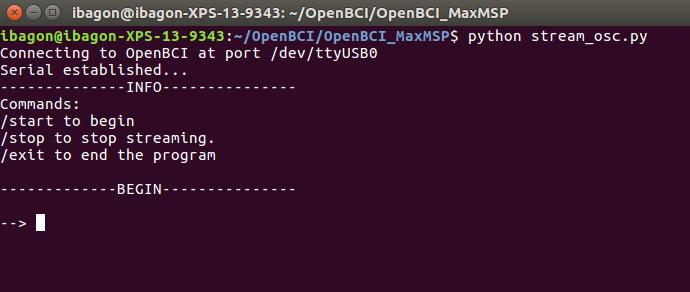
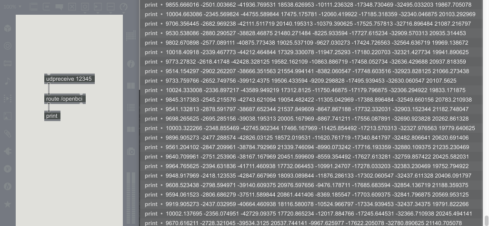
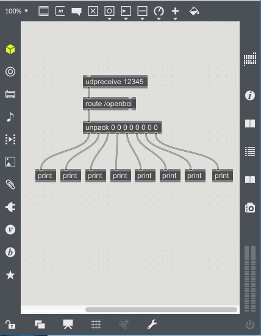

Using OpenBCI in Max/MSP
==========================

This repository contains an in implementation to get OpenBCI biodata into MaxMSP using OSC.

[OpenBCI](http://openbci.com/) is a company that produces open-source equipment for recording biosignals such as EEG (brain activity), EMG (muscle activity), and ECG (heart activity). This data is streamed into your computer via a USB Serial port, where you can then access the raw data for analysis, visualization, etc.

This guide shows you a way to stream OpenBCI data into Max MSP in order to explore creative ways to work with brain signals. To run this tutorial, you will need:

1. Python 2.7 (Python 3+ support under development!)
2. Max MSP

# Setup
## Download the repository
This repository contains the files you will need to run in order to start streaming data and sending it to MaxMSP. 

**Two methods:** 

  1. **Method One**: Type `git clone https://github.com/gabrielibagon/OpenBCI_MATLAB.git` on the command line

  2. **Method Two**: Click "Clone or download" near the top right of the page, and click "Download Zip". Unzip the file into a directory of your choice

## Python Setup
  1. [Download Python](https://www.python.org/downloads/) (either version 2.7 or 3.5) onto your computer.

# Usage
## Start Streaming
1. Go to your command line/terminal, and navigate to the "OpenBCI_MaxMSP" folder.

2. Type:

  `python stream_osc.py`

  You should then receive some output (such as the OpenBCI Board identification). You will then be presented with a `-->`, like this:

  *

  	
3. Press "/start" to begin streaming from the board. Remember to have your board turned on and dongle plugged in first!

## Receive the Stream in Max

Here is a basic Max setup for receiving the raw values sent out from the OpenBCI board. The most important component in the [udpreceive 12345] object ("12345" is the port number that OpenBCI uses to send information over OSC):

  *

Once you have this together, you are ready to start manipulating biodata in Max! The rest of the tutorial explains a few basic ways to handle this data. This should be straightforward for experienced Max users, but useful for those new to the platform.

### Unpack the data: 

Use the [unpack] object to separate the various values in your data stream (e.g. the 8 electrodes). Here is an example that unpacks and prints the 8 channels individually.

  *

### Filter the data

MaxMSP has great digital signal processing capabilities, and filtering is a significant part of working with EEG/EMG/ECG data. Many researchers use filters to preprocess neural data to remove significant sources of noise in the signal. However, the type of filters you use (or even the choice to use filters at all) will depend on your situation and goals. For an in-depth explanation of filtering EEG data, read [Digital filter design for electrophysiological data – a practical  approach](http://www.ncbi.nlm.nih.gov/pubmed/25128257)

For this tutorial, we'll focus on three basic noise-reducing filters: a **notch filter**, **highpass filter**, and **lowpass filter**

The notch filter is used to reduce the 60Hz spike introduced into the signal by electrical line noise.

TODO

### Statistical Analysis in Python
TODO

### Statistical Analysis in Max
TODO

### Generate sound with the data
TODO

### Sending the data to Ableton
TODO

Use your creativity to find ways to manipulate and explore this data, and feel free to reach out to me if you've thought of something interesting.

